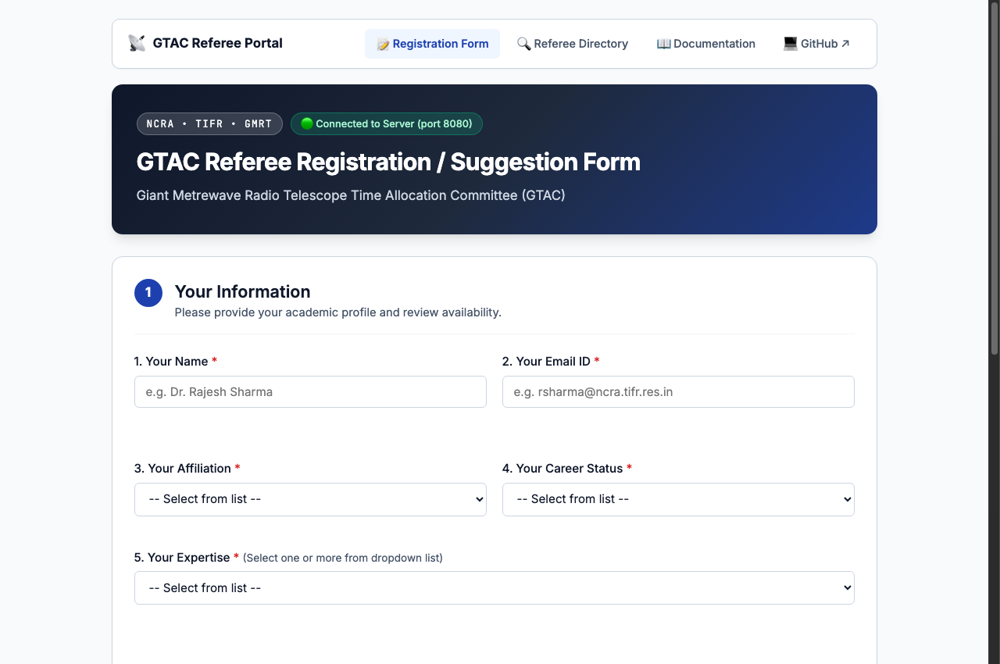
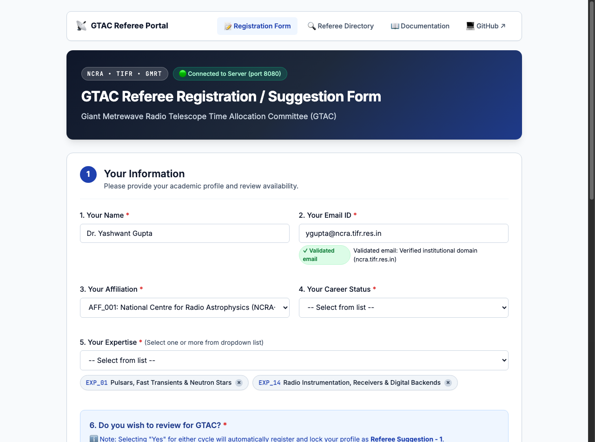
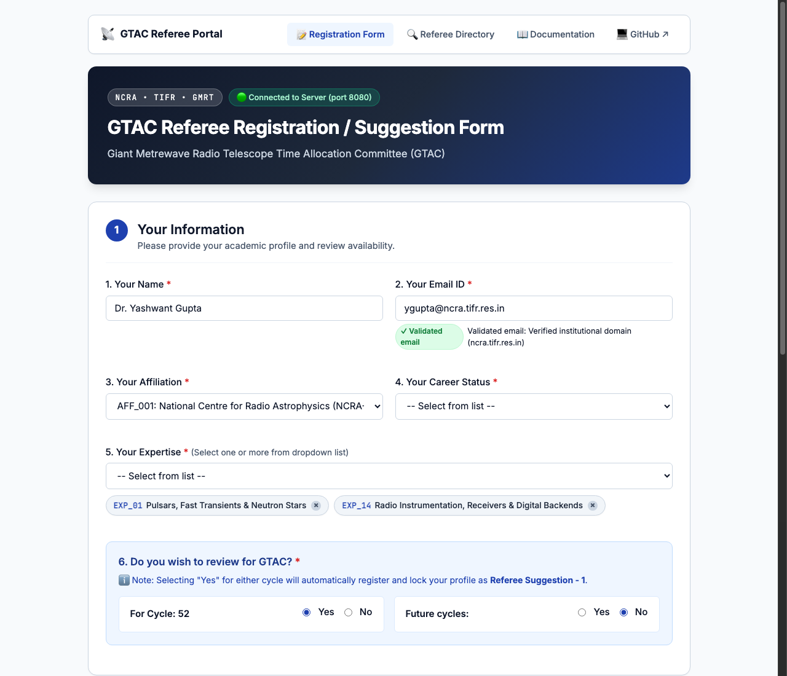
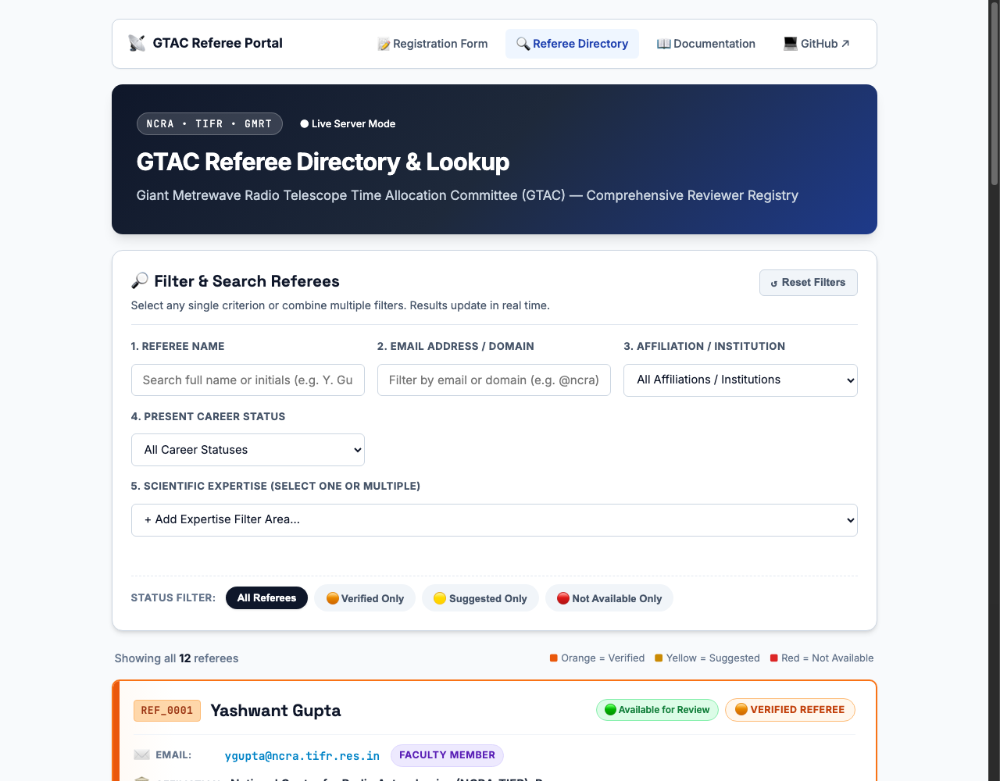
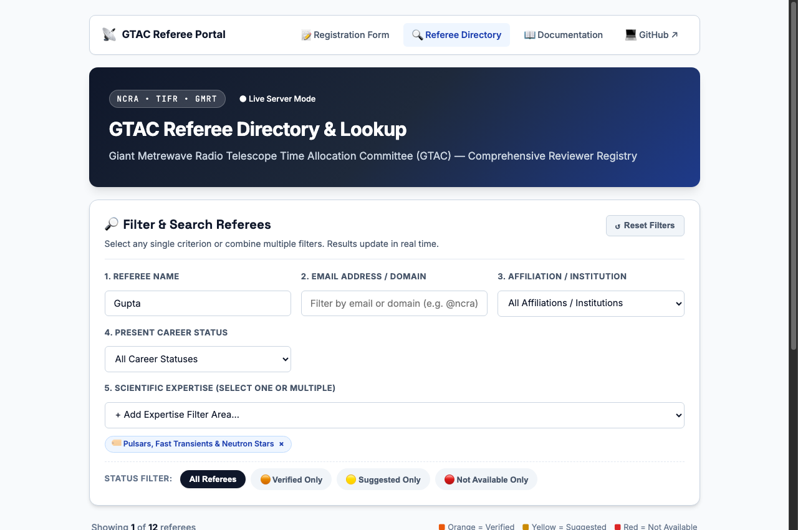

# Welcome to the GTAC Referee System Wiki

> **Giant Metrewave Radio Telescope Time Allocation Committee (GTAC)**  
> National Centre for Radio Astrophysics (NCRA-TIFR), Pune, India

The **GTAC Referee Registration and Suggestion System** (`GTAC_REF`) is a dedicated intake platform and referee database manager. It streamlines volunteer referee intake, peer reviewer suggestions, institutional validation, and automated registry synchronization for GMRT observing proposal cycles.

---

## 🚀 Live Access & Sharing Links

Anyone can access and use the form or browse the documentation via these public URLs:

| Resource | Public URL | Description |
| :--- | :--- | :--- |
| **Live Interactive Form** | [https://prasundutta151.github.io/GTAC_REF/](https://prasundutta151.github.io/GTAC_REF/) | The full, live, interactive HTML5 referee registration & suggestion form. |
| **Referee Directory & Lookup** | [https://prasundutta151.github.io/GTAC_REF/referees.html](https://prasundutta151.github.io/GTAC_REF/referees.html) | Live searchable registry with human-readable values and color-coded status blocks (Orange, Yellow, Red). |
| **Interactive HTML Docs** | [https://prasundutta151.github.io/GTAC_REF/doc/README.html](https://prasundutta151.github.io/GTAC_REF/doc/README.html) | Rich multi-page documentation with search, responsive sidebar, and guides. |
| **GitHub Repository** | [https://github.com/prasundutta151/GTAC_REF](https://github.com/prasundutta151/GTAC_REF) | Main source code repository. |

---

## 📚 Wiki Contents

1. **[[Form-Guide|📋 Form System Guide]]**: Detailed breakdown of every input field, Question 6 review volunteering, dark add-bar interaction, real-time Gemini validation, half-initials matching, and ordered submission summaries.
2. **[[Referee-Directory|🔍 Referee Directory & Lookup]]**: Comprehensive guide for the live reviewer registry, multi-criteria filtering (Name, Email, Affiliation, Career, Expertise), color-coded row cards (Orange, Yellow, Red), and font typography.
3. **[[Database-Architecture|🗄️ Database Architecture]]**: Overview of plain-text ASCII taxonomies (`affiliations.txt`, `expertise.txt`, `career_status.txt`, `cycle.txt`), relational CSV registries (`Referee_database_A.csv`, `form_submissions.csv`), and offline bundles (`db_data.js`).
4. **[[REST-API-and-CLI|⚡ REST API & CLI Reference]]**: Detailed documentation of the Python backend REST API and the `util` developer command-line tool.

---

## 🌟 Key System Capabilities

* **✨ Gemini AI Auto-Validation by Default**: As soon as a referee or submitter name/email is entered, the system validates the credentials against Gemini AI / institutional heuristics and displays a green `✓ Validated email` notice.
* **🔓 Full Editability Guarantee**: Even after successful database verification or Gemini validation, **all referee card inputs remain completely editable**. No fields are locked into a disabled state.
* **🔄 Dynamic GTAC Cycle Reading**: Question 6 dynamically displays `For Cycle: 52` loaded from `database/cycle.txt` without hardcoded cycle text.
* **🔘 Full-Length Dark Add-Bar**: Positioned directly beneath all active cards, sequentially handling Own Entry (Block 1) followed by peer suggestions (Others Entry).
* **🧹 Automatic Title Stripping**: Honorific prefixes (`Dr`, `Prof`, `Mr`, etc.) are cleanly stripped prior to database indexing.
* **🔍 Half-Initials Matching**: Cross-checks entered names like `Y. Gupta`, `J. Chengalur`, or `P. Dutta` against full database records (`Yashwant Gupta`, `Jayaram Chengalur`, `Prasun Dutta`).
* **⭐ Submitter Self-Entry Preference**: Submitter's own entries authoritatively update database records and are never overwritten by existing suggestions.
* **📋 Clean Post-Submission Summary**: Nicely ordered summary of all submitted data without leaking internal file storage paths.

---

## 📸 Visual Walkthrough & System Screenshots

The following operational screenshots demonstrate the core user workflows across the Registration Form and the Referee Directory:

### 1. Submitter Intake & Profile Configuration
The intake form gathers researcher profile details, dynamically pulls institutional taxonomies, and reads the active GTAC proposal cycle.


*Figure 1: GTAC Referee Intake Form header, navigation bar, and Submitter Profile section.*

---

### 2. Gemini AI Validation & Review Volunteering
Entering an institutional email triggers real-time credential validation. Selecting review willingness dynamically links the submitter's profile to Block 1.


*Figure 2: Real-time Gemini email validation badge (`✓ Validated email`) and Question 6 review volunteering options for Cycle 52.*

---

### 3. Dynamic Referee Cards & Sequential Add-Bar
Reviewer suggestions are entered via distinct cards. Block 1 mirrors the submitter while subsequent cards allow peer recommendations, followed by the dark sequential add-bar.


*Figure 3: Referee suggestion cards showing Self-Entry (Block 1) and Peer Entry (Block 2) with the full-length dark add-bar.*

---

### 4. Ordered Post-Submission Summary
Upon submission, a modal presents an ordered, human-readable summary of the submission metadata and assigned referee IDs without internal file paths.


*Figure 4: Clean post-submission confirmation modal with assigned reference IDs and structured data presentation.*

---

### 5. Referee Directory & Live Lookup
The public Referee Directory (`referees.html`) displays reviewers in rectangular cards color-coded by status (Orange: Verified, Yellow: Suggested, Red: Unavailable).


*Figure 5: Referee Directory with multi-criteria selection form and color-coded status row blocks.*

---

### 6. Real-Time Multi-Criteria Filtering
Reviewers can be queried instantly across Name, Email, Affiliation, Career Status, and Multi-Select Expertise tags.


*Figure 6: Live multi-criteria search filtering for specific researchers and scientific disciplines.*

---

## ⚡ Quick Start for Developers

```bash
# Clone the repository
git clone git@github.com:prasundutta151/GTAC_REF.git
cd GTAC_REF

# Start local server (default: port 8080)
./util --serve

# Open in browser
open http://localhost:8080
```
