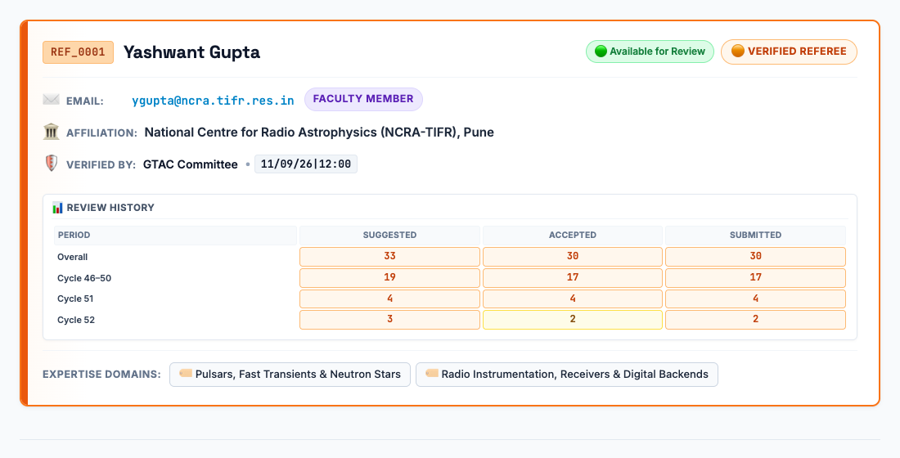

### 📡 GTAC Referee System

* **[[Home]]**
* **[[Form-Guide|📋 Form System Guide]]**
* **[[Referee-Directory|🔍 Referee Directory & Lookup]]**
* **[[Database-Architecture|🗄️ Database Architecture]]**
* **[[REST-API-and-CLI|⚡ REST API & CLI]]**
* **[[REST-API-and-CLI#🚀-production-deployment--central-database-setup-options|🚀 Production Setup]]**

---

### 📸 Operational Screenshots

* **[[Home#1-submitter-intake--profile-configuration|📋 1. Form Intake]]**
* **[[Home#2-gemini-ai-validation--review-volunteering|🤖 2. Validation & Volunteering]]**
* **[[Home#3-dynamic-referee-cards--sequential-add-bar|🃏 3. Referee Cards]]**
* **[[Home#4-ordered-post-submission-summary|✅ 4. Submission Modal]]**
* **[[Home#5-referee-directory--live-lookup|🔍 5. Referee Directory]]**
* **[[Home#6-real-time-multi-criteria-filtering|⚡ 6. Instant Filtering]]**
* **[[Home#7-referee-card-with-review-history-table|📊 7. Referee Card & Stats]]**
* **[[Home#8-mobile-phone-responsive-layout|📱 8. Mobile Responsive Card]]**

#### 🃏 Live Referee Card Preview:

---

### 🌐 Live Links

* [🚀 **Launch Live Web Form**](https://prasundutta151.github.io/GTAC_REF/)
* [🔍 **Referee Directory & Lookup**](https://prasundutta151.github.io/GTAC_REF/referees.html)
* [📖 **Interactive HTML Docs**](https://prasundutta151.github.io/GTAC_REF/doc/README.html)
* [💻 **GitHub Repository**](https://github.com/prasundutta151/GTAC_REF)

---
*Release Version: `v01.00.17`*
